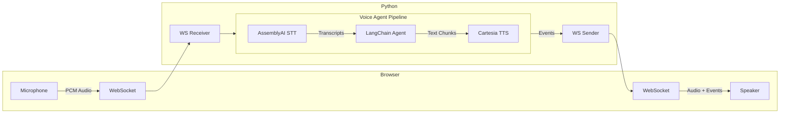

# Voice personal assistant: outline (WebSocket transport)

## 1. End-to-end architecture

- **Transport**: **WebSockets** for bidirectional, low-latency **audio frames**, **control** (start/stop listen, cancel/barge-in), and **server events** (partial/final transcripts, TTS chunks, errors). Prefer **one WebSocket per voice session** with a small **JSON + binary** convention (e.g. JSON envelopes for metadata; binary payloads for PCM/opus chunks). Do **not** use **SSE** or **chunked HTTP** for the live voice loop; plain HTTP remains fine for **health**, **OAuth callbacks**, **REST helpers**, or a **one-shot upload** during early vendor bring-up only.
- **Orchestration layer**: Same as before: thin **session/orchestrator** between the socket edge and the agent—VAD/turn boundaries, transcript assembly, user vs assistant turn, **cancellation** on interrupt, and mapping streaming STT/TTS to your WebSocket message contract.

## 2. Your chosen components (integration checklist)

| Piece               | What to nail down                                                                                                                                                               |
| ------------------- | ------------------------------------------------------------------------------------------------------------------------------------------------------------------------------- |
| **AssemblyAI**      | Streaming vs batch; language models; **partial vs final** transcripts; punctuation; **end-of-turn** signals if you use them; API keys and rate limits; error codes and retries. |
| **Cartesia**        | Voice ID, format (e.g. PCM vs compressed), **latency mode**, streaming audio chunks; how you’ll **buffer** for smooth playback on the client.                                   |
| **LangChain agent** | Model choice, **tool calling** shape, **structured output** if you need it, and how you’ll **stream** tokens while TTS starts early (see §4).                                   |

Stable **internal contract**: orchestrator in/out (e.g. `UserTurn` → `AssistantTurn` with text stream + optional tool calls), independent of how messages are framed on the wire.

## 3. Agent design

- **Capabilities**: Calendar, email, search, file access, home automation—each implies **tools**, **auth**, and often **user confirmation** for destructive actions.
- **Memory**: Short-term (this conversation), long-term (preferences, facts). Where it lives (DB, vector store), **PII** handling, and **retention**.
- **Grounding**: If the assistant should use your data, plan **RAG** (chunking, embeddings, refresh) or direct API tools—not only “chat with an LLM.”
- **Safety**: System prompts, **tool allowlists**, output filtering for secrets, and policies for **jailbreak / prompt injection** when tools touch real systems.
- **Ambiguity**: How the agent asks **clarifying questions** in voice (short, one question at a time).

## 4. Latency and streaming

- **Pipeline overlap**: Start TTS on **sentence or clause boundaries** while the LLM is still generating (tradeoff: occasional revision if the model backtracks—usually acceptable with buffered playback).
- **STT streaming**: Feed partial transcripts only for UI; drive agent turns from **final** segments unless you explicitly design for “user still talking.”
- **Barge-in / interrupt**: Client stops playback and sends a **cancel** signal; server cancels in-flight LLM/TTS where the APIs allow it.
- **Timeouts**: Hard limits per stage (upload, STT, LLM, TTS) so the client never hangs silently.

## 5. Audio and client responsibilities

- **Format**: Sample rate, channels, encoding end-to-end (record → upload → STT → TTS → play).
- **VAD**: Browser/WebRTC VAD vs server-side; affects how you chunk audio and detect end of speech.
- **Volume / echo**: If hands-free, consider echo cancellation and when to open/close the mic (half-duplex vs full-duplex).

## 6. API and session model (FastAPI-specific)

- **WebSocket route(s)**: e.g. `GET /ws/voice` or `/ws/voice/{session_id}` with auth (query token, cookie, or subprotocol—pick one pattern and document it).
- **Session ID**: Same as before; tie STT, history, optional user id.
- **State**: In-memory for prototypes; **Redis** or DB for multi-worker / scale-out (consider connection affinity or shared session store).
- **Auth, rate limits, quotas**: Unchanged.

## 7. Observability, testing, and operations

- **Tracing**: Propagate a **trace id** in WebSocket **connection** or **first message**; log structured events per message type (not raw audio in prod without policy).
- **Metrics**: Time-to-first-audio, time-to-final-transcript, vendor errors, cost; **WebSocket** connect/disconnect and message rates.
- **Testing**: Mock vendor streams in CI; contract tests for **JSON/binary framing**; load on concurrent **WebSocket** sessions.
- **Deployment**: **WSS** behind TLS; sticky sessions only if required by your session store design; health checks.

## 8. Compliance and product

- **Consent**: Recording notices, data retention, export/delete.
- **Cost model**: Per-minute STT/TTS + token usage; caps and alerts.

## 9. Suggested implementation phases

1. **Vendor paths (optional HTTP)**: Upload or small script → AssemblyAI → text; then text → Cartesia → audio (validates keys and formats without socket complexity).
2. **WebSocket MVP**: Single session—client sends audio chunks; server returns partial/final transcripts and eventually simple replies (still without full agent if needed).
3. **LangChain agent + tools** behind the same orchestrator contract over the same socket.
4. **Streaming LLM + chunked TTS**, then **barge-in** and polish.

---

**Summary**: Real-time client–server flow is **WebSocket-only** for the voice loop; **SSE/chunked HTTP** are out of scope for that path. Success still hinges on orchestration, agent/tool/safety design, session/auth, and observability—with an explicit **message schema** early so client and server stay aligned.
